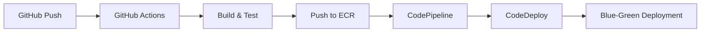

# Photo Gallery Application - AWS ECS Fargate Deployment

A full-stack Java Spring Boot application for photo upload and gallery display, deployed on AWS ECS Fargate with secure, private networking architecture.

## 📋 Project Overview

This project implements a containerized photo gallery application that allows users to upload images with descriptions. The architecture ensures all storage and retrieval flows are private and secure without exposing S3 buckets directly.

### 🎯 Functional Requirements
- Web-based photo gallery (no authentication required)
- Display images with descriptions
- Upload new images with descriptions

### ⚙️ Technical Requirements
- **Infrastructure**: VPC with private subnets, VPC endpoints, no NAT gateway
- **Database**: RDS PostgreSQL instance restricted to ECS Fargate
- **Storage**: Private S3 bucket accessible only via VPC Gateway Endpoint
- **Deployment**: Blue-green deployments with CodeDeploy

## 🏗️ Architecture


### Core Components
- **Frontend**: Simple web UI (HTML/CSS/JS)
- **Backend**: Spring Boot application (Java 21)
- **Database**: PostgreSQL RDS instance
- **Storage**: Private S3 bucket for images
- **Containerization**: Dockerized application on ECS Fargate
- **Networking**: VPC with public/private subnets, VPC endpoints

## 📁 Project Structure

```
├── src/                          # Spring Boot application source
├── Dockerfile                    # Container definition
├── cloudformation/
│   ├── infrastructure.yaml       # Core infrastructure stack
│   ├── service.yaml             # ECS service stack
│   └── pipeline.yaml            # CI/CD pipeline stack
├── .github/workflows/
│   └── deploy-to-ecr.yml        # GitHub Actions deployment
└── README.md
```

## 🚀 Deployment Architecture

### Infrastructure Stacks
1. **Infrastructure Stack** (`infrastructure.yaml`)
    - VPC with public/private subnets
    - RDS PostgreSQL database
    - S3 bucket with VPC endpoint restrictions
    - ECR repository, IAM roles, security groups
    - Application Load Balancer

2. **Service Stack** (`service.yaml`)
    - ECS cluster and task definitions
    - Fargate service with CodeDeploy configuration
    - Auto-scaling policies
    - Blue-green deployment setup

3. **Pipeline Stack** (`pipeline.yaml`)
    - CodePipeline for automated deployments
    - Blue-green deployment automation
    - EventBridge triggers for ECR push events

### CI/CD Pipeline


## 🔒 Security Features

### Network Security
- **No NAT Gateway**: All communication uses VPC endpoints
- **Private Subnets**: ECS tasks run in isolated subnets
- **VPC Endpoints**: S3, ECR, Secrets Manager, CloudWatch Logs
- **Security Groups**: Least privilege access between components

### IAM Roles
- **Task Execution Role**: ECR pull, secrets access, CloudWatch logging
- **Task Role**: S3 access, RDS connectivity, presigned URL generation
- **Least Privilege**: Minimal permissions for each role

### Data Protection
- **Private S3 Bucket**: No public access, VPC endpoint only
- **Database Security**: ECS-only access, no public endpoint
- **Secrets Management**: AWS Secrets Manager for credentials

## 🛠️ Deployment Steps

### Prerequisites
- AWS CLI configured
- GitHub repository with OIDC configuration
- Java 21 and Gradle for local development

### 1. Deploy Infrastructure
```bash
aws cloudformation create-stack \
  --stack-name java-full-stack-infra \
  --template-body file://cloudformation/infrastructure.yaml \
  --parameters ParameterKey=AppName,ParameterValue=java-full-stack
```

### 2. Deploy ECS Service
```bash
aws cloudformation create-stack \
  --stack-name java-full-stack-service \
  --template-body file://cloudformation/service.yaml \
  --parameters ParameterKey=AppName,ParameterValue=java-full-stack
```

### 3. Configure GitHub Secrets
Set the following secrets in your GitHub repository:
- `AWS_IAM_ROLE_ARN`: OIDC role ARN from infrastructure outputs
- `ECR_REPOSITORY_NAME`: ECR repository name

### 4. Trigger Deployment
Push to the `master` branch to trigger the automated pipeline:
```bash
git push origin master
```

## 🌐 Accessing the Application

After deployment, access the application via the ALB DNS name:
```bash
# Get the ALB endpoint
aws cloudformation describe-stacks \
  --stack-name java-full-stack-infra \
  --query "Stacks[0].Outputs[?OutputKey=='ALBDNSName'].OutputValue" \
  --output text

# Access in browser
open http://<alb-dns-name>
```

## 📊 Monitoring & Logs

### CloudWatch Logs
Application logs are streamed to CloudWatch:
```bash
aws logs describe-log-streams \
  --log-group-name /ecs/java-full-stack \
  --query 'logStreams[0].logStreamName' \
  --output text
```

### ECS Service Metrics
Monitor service health and performance:
- CPU/Memory utilization
- Request counts and latency
- Healthy host counts

## 🔄 Blue-Green Deployments

The pipeline implements zero-downtime deployments:
1. **New version** deployed to green environment
2. **Health checks** validate new deployment
3. **Traffic shift** from blue to green
4. **Old version** terminated after success

## 🐛 Troubleshooting

### Common Issues

1. **ECR Pull Errors**
    - Check VPC endpoint policies
    - Verify ECS task execution role permissions
    - Validate security group rules

2. **Database Connection Issues**
    - Verify RDS security group ingress rules
    - Check secrets manager access
    - Validate database endpoint connectivity

3. **S3 Upload Failures**
    - Confirm VPC endpoint route table associations
    - Check S3 bucket policy conditions
    - Verify task role S3 permissions

### Debug Commands

```bash
# Check ECS task status
aws ecs describe-tasks \
  --cluster java-full-stack-Cluster \
  --tasks <task-id>

# Verify ALB health
aws elbv2 describe-target-health \
  --target-group-arn <target-group-arn>

# Check CloudFormation stack events
aws cloudformation describe-stack-events \
  --stack-name java-full-stack-service
```

## 📈 Scaling

### Auto-Scaling Configuration
- **CPU-based scaling**: 70% CPU utilization threshold
- **Min capacity**: 1 task
- **Max capacity**: 4 tasks
- **Scale-in cooldown**: 300 seconds

### Manual Scaling
```bash
aws application-autoscaling register-scalable-target \
  --service-namespace ecs \
  --scalable-dimension ecs:service:DesiredCount \
  --resource-id service/java-full-stack-Cluster/java-full-stack-Service \
  --min-capacity 2 \
  --max-capacity 6
```

## 🧹 Cleanup

To avoid ongoing charges, delete the CloudFormation stacks:

```bash
aws cloudformation delete-stack --stack-name java-full-stack-service
aws cloudformation delete-stack --stack-name java-full-stack-pipeline
aws cloudformation delete-stack --stack-name java-full-stack-infra
```

## 📚 Resources

- [AWS ECS Documentation](https://docs.aws.amazon.com/ecs/)
- [CloudFormation User Guide](https://docs.aws.amazon.com/AWSCloudFormation/latest/UserGuide/)
- [Spring Boot Documentation](https://spring.io/projects/spring-boot)
- [Docker Documentation](https://docs.docker.com/)

## 👥 Contributors

- [Your Name/Team]

## 📄 License

This project is licensed under the MIT License - see the [LICENSE](LICENSE) file for details.